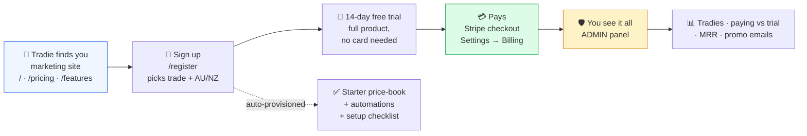
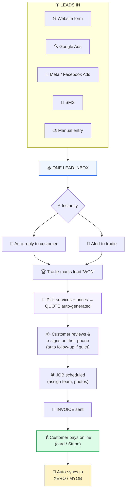

# LeadFlow Pro — How the Platform Works (One Page)

**AI-powered lead → quote → job → paid platform for AU & NZ trades.**
There are two journeys: **your SaaS business** (selling LeadFlow) and **the tradie's business** (using it).

---

## Journey 1 — Your SaaS business (how you earn)

**Admin panel (`/admin`, you only):** total tradies · paying vs trial · monthly revenue (MRR) · per-tradie usage · send promo emails.

---

## Journey 2 — The tradie's daily flow (the core engine — mostly automatic)

### The flow in words
1. **Lead arrives** from any source → lands in one inbox.
2. **Instantly:** customer gets an auto-reply, tradie gets an alert.
3. **Tradie wins it** → picks services/prices → **quote generated automatically**.
4. **Customer e-signs** the quote on their phone (auto follow-up if they go quiet).
5. **Quote becomes a job** → scheduled, done, photographed.
6. **Invoice sent** → **customer pays online**.
7. **Invoice + payment auto-sync to Xero/MYOB.**

---

## Always running underneath

| Layer | What it does |
|---|---|
| **Automations** | Auto-replies, quote follow-ups, review requests, payment reminders — email + SMS |
| **Notifications** | Tradie alerted on every key event: new lead, quote viewed, quote approved, payment received |
| **Easy setup** | Starter price-book per trade, bulk price import from Excel/CSV, logo + brand colour, guided onboarding checklist |

---

## In one sentence

> **You** sell a tool that **captures a tradie's leads, turns them into signed quotes and paid invoices, and handles the follow-ups and accounting automatically** — while your **Admin panel** shows how many tradies use it and how much you earn.

---

## Who sees what

- **Customer (homeowner):** only the quote-approval page and the invoice payment page (no login).
- **Tradie & their team:** their own private workspace — leads, quotes, jobs, invoices, schedule, settings.
- **You (LeadFlow owner):** the Admin panel across all tradies — counts, revenue, promos.
